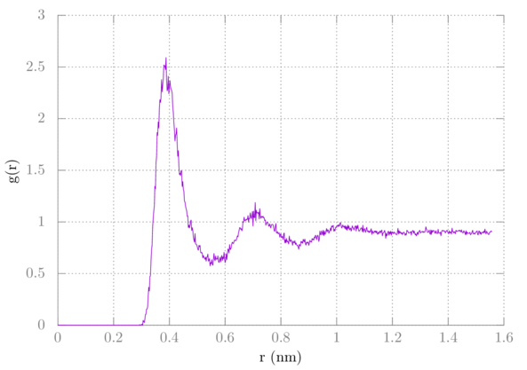
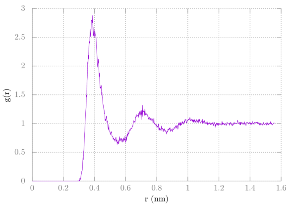
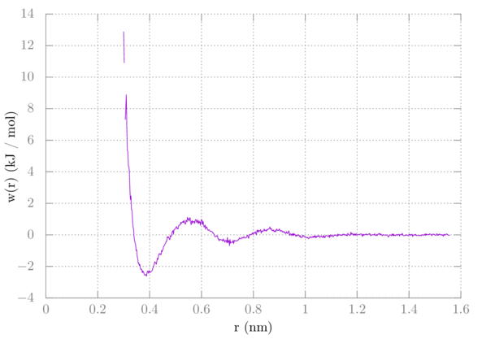

Tutorial 3: Several Methanes in Water
=====================================

In this tutorial I'll show you how to create a system containing several OPLS
methane in a box of TIP4PEW water and get the methane-methane potential of mean
force from this information.

Setup
-----

Reuse `methane.pdb` and `topol.top` from the last tutorial (make copies). Remove
all of the waters in `topol.top` by deleting the line containing `SOL` under `[
molecules ]`. We're going to perform our simulation on 10 methanes in 1000
waters. As a starting point we'll set the box to be 3.2 nm in each direction.
Obviously when we add pressure coupling this will go to the correct size, but we
want to start somewhere close. The density of water is close to 33.5 molecules /
nm^3, so the cube root of 1010/33.5 is around 3.11, so rounding up gives me 3.2
nm.

First, insert ten methanes into a 3.2 nm x 3.2 nm x 3.2 nm box:

```bash
gmx insert-molecules -ci methane.pdb -o box.gro -nmol 10 -box 3.2 3.2 3.2
```

Update the line in `topol.top` containing the number of methanes from 1 to 10.

Then add water to the box:

```bash
gmx solvate -cs tip4p -cp box.gro -o conf.gro -p topol.top -maxsol 1000
```

*gmx solvate* automatically updates `topol.top` for us.

Reuse the .mdp files from last time, except change `nsteps` in `prd.mdp` to be
longer. I myself ran this for 100 ns, so I simply added a 0 to the end of the
number from last time.

Simulation
----------

Run the simulation just like last time.

Analysis
--------

Create an index file containing a group of the 10 methanes:

```bash
gmx make_ndx -f conf.gro
```

```
a C
q
```

Now use *gmx rdf* just like last time, but instead choose the group containing
`C` twice.

Depending on how many frames you saved and how long you ran the simulation (I
ran mine for 100 ns and saved 25,000 frames), you should get an RDF that looks
something like this if you just plot it normally:



Note that it does not converge to one. We are overcounting by one, so we should
factor that out. Here's the gnuplot command:

```gnuplot
plot 'rdf.xvg' u 1:($2*10/9) w l
```

We have ten methanes, but we should only be counting nine with the RDF, so we
multiply the value of g by N/(N-1), which is 10/9. It should look like this:



Now to get the methane-methane [potential of mean
force](https://en.wikipedia.org/wiki/Potential_of_mean_force) (PMF) from the
methane-methane RDF we do w = -kTln(g).

So to plot this with gnuplot do:

```gnuplot
plot 'rdf.xvg' u 1:(-8.314e-3*298.15*log($2*10/9)) w l
```

Your plot should look something like this:



Summary
-------

In this tutorial we created a box of 10 methanes and 1000 waters using *gmx
insert-molecules* and *gmx solvate*. We simulated this just like last time,
except we did it a little longer. We again used *gmx rdf* to get the radial
distribution function, but this time for methane-methane. We had a to add a
correction due to this, and from there we were able to get the potential of mean
force.
